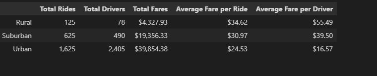
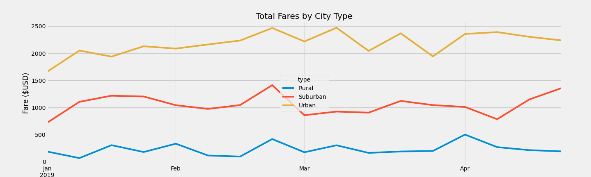

# PyBer Analysis
Visualizing Ride-Share Data
## Overview of the analysis
Pyber is a Python based ride-share company. The ride-share data is broken down by city types: Urban, Suburban, and Rural. I am tasked with summarizing the ride-share data by city types to show:
1.	The total number of rides for each city.
2.	The total number of drivers for each city type.
3.	The total amount of fares for each city 
4.	The average fare per ride for each city type.
5.	The average fare per driver for each city type.
6.	A line chart plotting the fare for each week by city type.
## Resources
- Data Sources: city_data.csv, ride_data.csv
- Software: Python 3.7.10, Anaconda 4.10.3, Juypter Notebook 6.3.0

## Results

**Image 1**

Analysis of the PyBer data is summarized in the chart above in Image 1. The analysis reveals that:
1.	Urban cities have the highest total number of rides and drivers which brings in the highest total amount of fares. Suburban areas have less drivers, rides, and total fares than Urban areas but more than Rural areas. 
2.	Urban cities have 13x more rides but 30x more drivers than rural cities have. While number of rides and drivers between Urban and Rural cities is massive, Urban cities bring only 1.5x more fares than Suburban cities and less than x more than Rural cities
3.	Rural cities have the highest average fare per ride and the highest fare per driver. The average fare is about $10 more in Rural cities than Urban cities and almost $4 more than Suburban cities. 
4.	The average Suburban fare per ride is $15 more than Urban while the average fare per ride is 23$ more than urban. Both averages for fare per ride and fare per driver are the lowest in Urban cities.
5.	The average fare per driver was lower than the average fare per ride for the Urban city type while both Rural and Suburban fare per driver were higher than fare per ride.
6.	The total fares by week for city type during January to May of 2019 is charted below in image 2. It shows Urban has the highest number of fares, then Suburban, and Rural. It also suggests that the highest fluctuation over this period is in Urban cities fluctuating between 1500 to 2500 fares while Rural maintains about 500 fares or less. Suburban fares fluctuate between a little above 500 fares to almost 1500 fares. There are peaks for all three city types near the end of February. 

**Image 2**

## Summary
Given how city types are typically defined by population density, Urban cities have more people thus more drivers and the destinations are usually closer which accounts for the huge number of drivers and number of fares. This also accounts for the low fare per driver stats. Urban cities have 30x more drivers than rural areas, 5x more than Suburban, and destinations are shorter. Urban drivers will have more rides that cost less (shorter trips) than the longer rides from Suburban and Rural areas where destinations are further apart.
The fluctuations for Urban cities could be due to events such as spring break or holidays. The same could be said for why all three city types saw a peak during the same time in February. Learning the location of these cities could help to understand why these peaks happened. 

